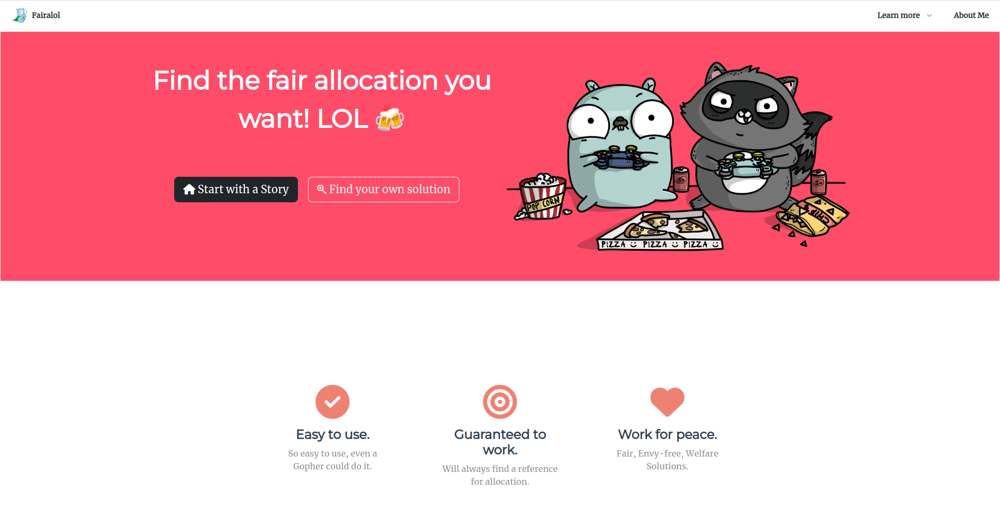
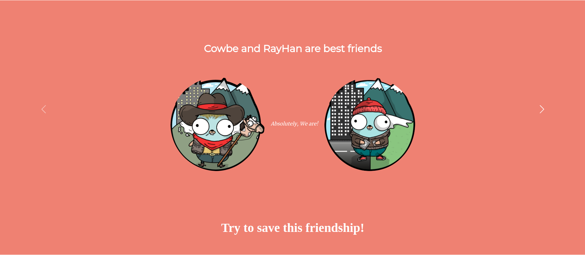
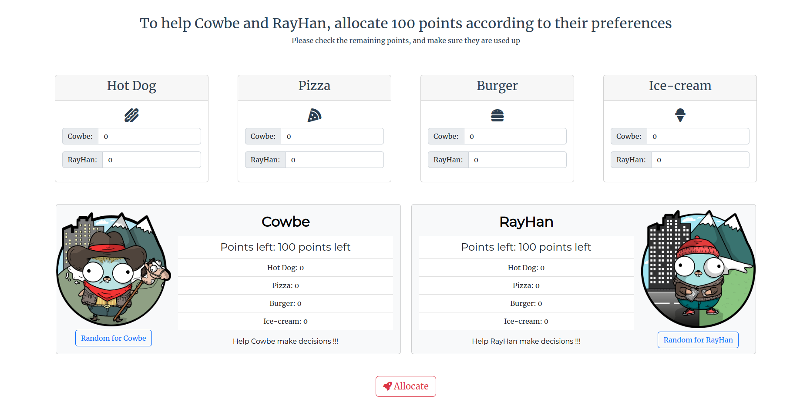
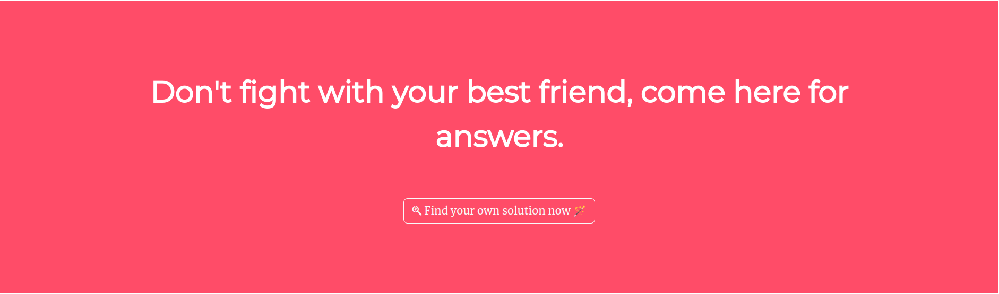
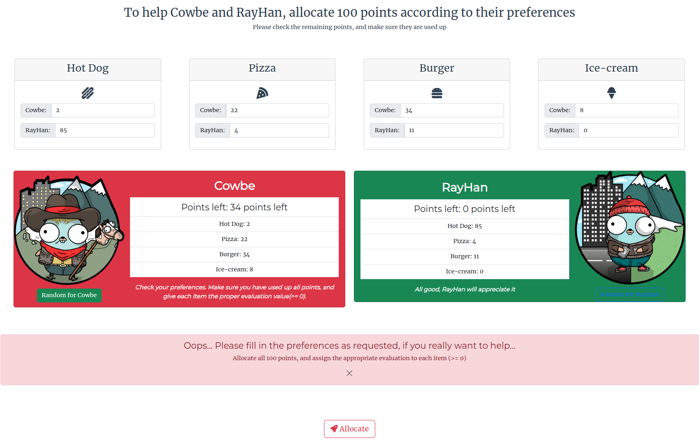
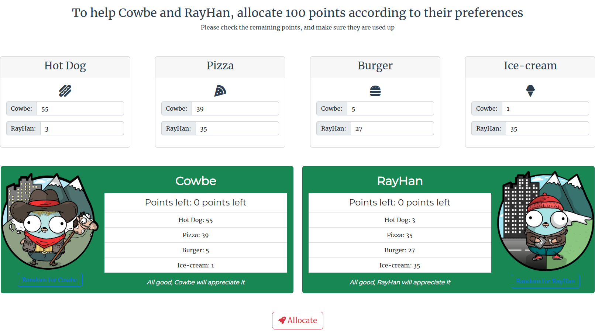
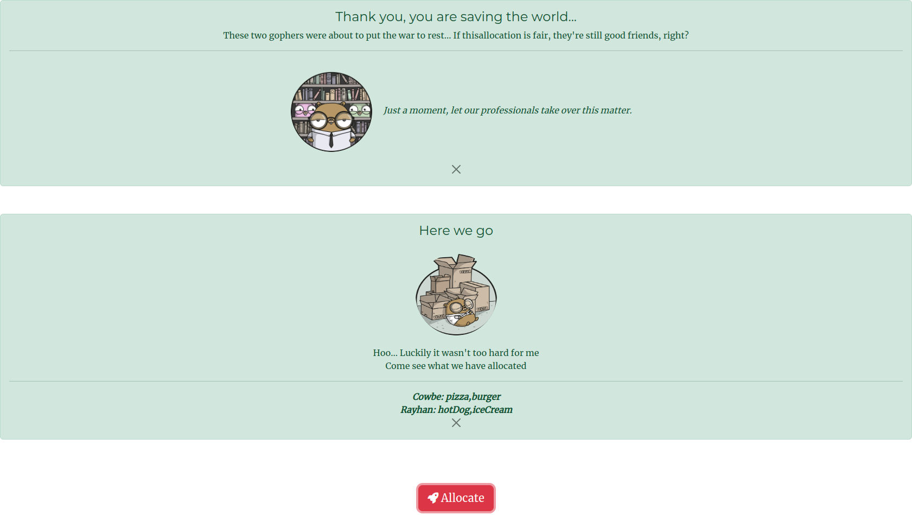
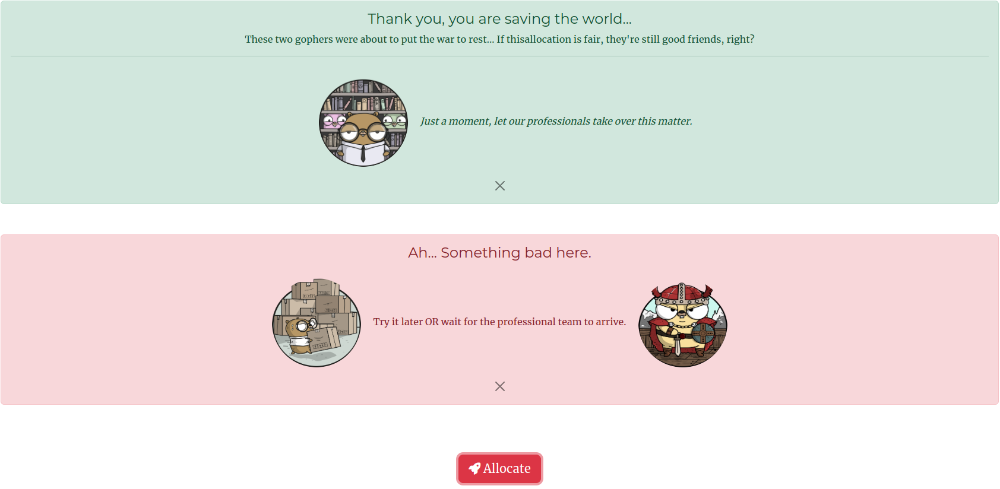

# fairallol - Fair Allocation LOL 🪄

## Find the fair allocation you are looking for! LOL 🍻

<div align=center>First Look</div>

<HR style="FILTER: alpha(opacity=100,finishopacity=0,style=1)" width="80%" color=#987cb9 SIZE=3>

<div align=center>Start with a <strong><i>Story</i></strong></div>

<HR style="FILTER: alpha(opacity=100,finishopacity=0,style=1)" width="80%" color=#987cb9 SIZE=3>

<div align=center>Save the World...</div>

<HR style="FILTER: alpha(opacity=100,finishopacity=0,style=1)" width="80%" color=#987cb9 SIZE=3>

<div align=center>Then... Find your Own Solution 🪄</div>

## Interactive

<div align=center>Bad Preferences?</div>

<HR style="FILTER: alpha(opacity=100,finishopacity=0,style=1)" width="80%" color=#987cb9 SIZE=3>

<div align=center>The Cute button knows what you want </div>

<HR style="FILTER: alpha(opacity=100,finishopacity=0,style=1)" width="80%" color=#987cb9 SIZE=3>

<div align=center>Everything is OK</div>

<HR style="FILTER: alpha(opacity=100,finishopacity=0,style=1)" width="80%" color=#987cb9 SIZE=3>

<div align=center>Something bad...</div>

## Project setup

```
yarn install
```

## Backend

You definitely need a back-end program. Take a look at [this](https://github.com/yongtenglei/fairallol_server).

❗Remember to change the `baseURL` in `src/api/config.js`.

### Compiles and hot-reloads for development

```
yarn serve
```

### Compiles and minifies for production

```
yarn build
```

## Contact Me

<a class="footer-link" href="https://github.com/LMLEC" target="_blank">Club</a>

<a class="footer-link" href="https://github.com/yongtenglei" target="_blank"><i class="fa-brands fa-github"></i>Github</a>

<a class="footer-link" href="mailto:yongtengrey@outlook.com"><i class="fa-solid fa-envelope"></i> Email Me</a>
